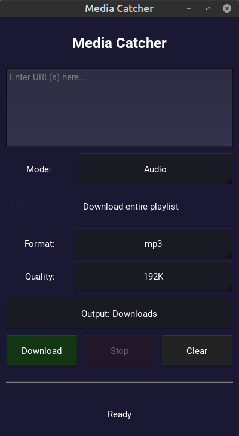

# Media Catcher 📱

A powerful Android application for downloading videos and audio from over 1000 supported platforms and websites directly to your device.


## ✨ Features

- 📹 **Video Downloads** - Multiple quality options (1080p, 720p, 480p, 360p, 240p)
- 🎵 **Audio Extraction** - Convert to MP3, WAV, or AAC formats
- 📋 **Playlist Support** - Download entire playlists or individual videos
- 💬 **Subtitles** - Download subtitles in multiple languages
- 🎨 **Material Design** - Modern, intuitive interface with dark theme
- 📁 **Custom Folders** - Choose where to save your downloads
- 🚫 **No Ads** - Completely free and open source
- 🔒 **Privacy First** - No tracking, no analytics

## 📱 Screenshot



## 🚀 Installation

### From F-Droid
Coming soon to F-Droid!

### From APK
1. Download the latest APK from [Releases](https://github.com/MarkusAureus/media-catcher-android/releases)
2. Enable "Unknown sources" in Android settings
3. Install the APK

### Build from source
```bash
# Clone repository
git clone https://github.com/MarkusAureus/media-catcher-android.git
cd media-catcher

# Install dependencies
pip install buildozer

# Build APK
buildozer android debug
```

## 🛠️ Development

### Requirements
- Python 3.7+
- Buildozer
- Android SDK/NDK (automatically downloaded by Buildozer)

### Setup
```bash
# Install Python dependencies
pip install -r requirements.txt

# Run on desktop (for testing)
python main.py

# Build for Android
chmod +x build_android.sh
./build_android.sh
```

### Project Structure
```
media-catcher/
├── main.py              # Main Kivy application
├── buildozer.spec       # Android build configuration
├── p4a-recipes/         # Custom Python-for-Android recipes
│   └── yt_dlp/         # yt-dlp recipe for Android
└── metadata/           # F-Droid metadata
```

## 🤝 Contributing

Contributions are welcome! Please feel free to submit a Pull Request.

1. Fork the repository
2. Create your feature branch (`git checkout -b feature/AmazingFeature`)
3. Commit your changes (`git commit -m 'Add some AmazingFeature'`)
4. Push to the branch (`git push origin feature/AmazingFeature`)
5. Open a Pull Request

## 📄 License

This project is licensed under the GNU General Public License v3.0 - see the [LICENSE](LICENSE) file for details.

## 🙏 Acknowledgments

- [yt-dlp](https://github.com/yt-dlp/yt-dlp) - The core download functionality
- [Kivy](https://kivy.org/) - Cross-platform Python framework
- [python-for-android](https://github.com/kivy/python-for-android) - Android packaging

## ⚠️ Disclaimer

This app is for personal use only. Please respect copyright laws and the terms of service of the platforms you download from. The developers are not responsible for any misuse of this application.

## 📧 Contact

- Create an [Issue](https://github.com/MarkusAureus/media-catcher-android/issues) for bug reports
- Email: marek_kozuch@protonmail.com

---


Made with ❤️ for the open source community
